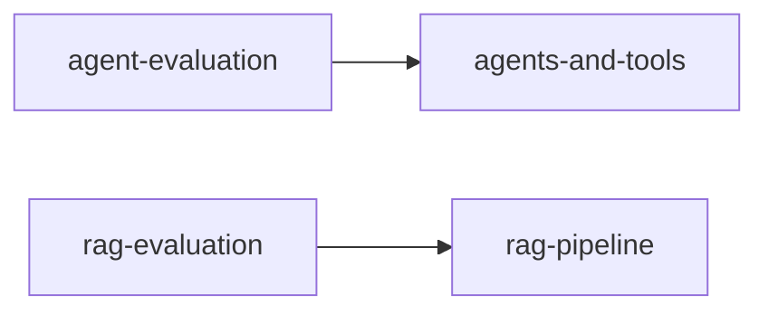

# Skill Dependency Graph

**Generated by `scripts/build_dependency_graph.py --write`. Do not hand-edit —
your changes will be overwritten on the next run. Edit the `requires` /
`related` / `conflicts` frontmatter fields in the source SKILL.md files instead.**

## Mermaid graph (hard `requires` edges only)

## Per-skill relationships

### `agent-evaluation` (workflow, llm)
- requires: `agents-and-tools`
- related: `agents-and-tools`, `llm-evaluation`, `rag-evaluation`, `ai-ml-security`
- conflicts: _none_

### `agents-and-tools` (reference, llm)
- requires: _none_
- related: `prompt-engineering`, `rag-pipeline`, `llm-evaluation`
- conflicts: _none_

### `ai-ethics-fairness` (reference, responsible-ai)
- requires: _none_
- related: `explainability`, `data-privacy`, `model-evaluation`
- conflicts: _none_

### `ai-ml-security` (reference, security)
- requires: _none_
- related: `agents-and-tools`, `agent-evaluation`, `rag-pipeline`, `rag-evaluation`, `ai-ethics-fairness`, `data-privacy`
- conflicts: _none_

### `attention-mechanisms` (reference, deep-learning)
- requires: _none_
- related: `neural-net-fundamentals`, `rnn-sequence`, `prompt-engineering`
- conflicts: _none_

### `ci-cd-for-ml` (workflow, mlops)
- requires: _none_
- related: `experiment-tracking`, `model-deployment`, `data-pipelines`
- conflicts: _none_

### `cnn-vision` (reference, deep-learning)
- requires: _none_
- related: `neural-net-fundamentals`, `training-deep-models`, `pytorch-patterns`
- conflicts: _none_

### `computer-vision` (workflow, specialized)
- requires: _none_
- related: `cnn-vision`, `data-preprocessing`, `model-evaluation`, `training-deep-models`
- conflicts: _none_

### `data-pipelines` (workflow, mlops)
- requires: _none_
- related: `data-preprocessing`, `feature-engineering`, `ml-monitoring`
- conflicts: _none_

### `data-preprocessing` (workflow, classical-ml)
- requires: _none_
- related: `feature-engineering`, `model-evaluation`, `supervised-learning`
- conflicts: _none_

### `data-privacy` (reference, responsible-ai)
- requires: _none_
- related: `ai-ethics-fairness`, `explainability`, `data-preprocessing`
- conflicts: _none_

### `experiment-tracking` (workflow, mlops)
- requires: _none_
- related: `hyperparameter-tuning`, `model-evaluation`, `ci-cd-for-ml`
- conflicts: _none_

### `explainability` (workflow, responsible-ai)
- requires: _none_
- related: `ai-ethics-fairness`, `data-privacy`, `model-evaluation`
- conflicts: _none_

### `feature-engineering` (workflow, classical-ml)
- requires: _none_
- related: `data-preprocessing`, `supervised-learning`, `unsupervised-learning`, `model-evaluation`
- conflicts: _none_

### `fine-tuning-llms` (workflow, llm)
- requires: _none_
- related: `attention-mechanisms`, `prompt-engineering`, `rag-pipeline`, `llm-evaluation`, `training-deep-models`
- conflicts: _none_

### `hyperparameter-tuning` (workflow, classical-ml)
- requires: _none_
- related: `model-evaluation`, `supervised-learning`, `feature-engineering`
- conflicts: _none_

### `llm-evaluation` (workflow, llm)
- requires: _none_
- related: `rag-pipeline`, `prompt-engineering`, `agents-and-tools`, `model-evaluation`
- conflicts: _none_

### `ml-math-essentials` (reference, foundations)
- requires: _none_
- related: `statistics-for-ml`, `python-for-ml`, `neural-net-fundamentals`
- conflicts: _none_

### `ml-monitoring` (workflow, mlops)
- requires: _none_
- related: `model-deployment`, `experiment-tracking`, `data-pipelines`
- conflicts: _none_

### `ml-problem-framing` (workflow, foundations)
- requires: _none_
- related: `feature-engineering`, `supervised-learning`, `model-evaluation`
- conflicts: _none_

### `model-deployment` (workflow, mlops)
- requires: _none_
- related: `model-optimization`, `ml-monitoring`, `ci-cd-for-ml`
- conflicts: _none_

### `model-evaluation` (workflow, classical-ml)
- requires: _none_
- related: `supervised-learning`, `hyperparameter-tuning`, `feature-engineering`, `data-preprocessing`
- conflicts: _none_

### `model-optimization` (workflow, mlops)
- requires: _none_
- related: `model-deployment`, `training-deep-models`, `hyperparameter-tuning`
- conflicts: _none_

### `neural-net-fundamentals` (reference, deep-learning)
- requires: _none_
- related: `attention-mechanisms`, `cnn-vision`, `rnn-sequence`, `training-deep-models`
- conflicts: _none_

### `nlp-tasks` (workflow, specialized)
- requires: _none_
- related: `attention-mechanisms`, `rnn-sequence`, `prompt-engineering`, `rag-pipeline`
- conflicts: _none_

### `prompt-engineering` (reference, llm)
- requires: _none_
- related: `rag-pipeline`, `agents-and-tools`, `fine-tuning-llms`, `attention-mechanisms`
- conflicts: _none_

### `python-for-ml` (reference, foundations)
- requires: _none_
- related: `data-preprocessing`, `feature-engineering`, `ml-math-essentials`
- conflicts: _none_

### `pytorch-patterns` (workflow, deep-learning)
- requires: _none_
- related: `training-deep-models`, `neural-net-fundamentals`
- conflicts: _none_

### `rag-evaluation` (workflow, llm)
- requires: `rag-pipeline`
- related: `rag-pipeline`, `llm-evaluation`, `model-evaluation`, `ai-ml-security`
- conflicts: _none_

### `rag-pipeline` (workflow, llm)
- requires: _none_
- related: `prompt-engineering`, `fine-tuning-llms`, `llm-evaluation`, `attention-mechanisms`
- conflicts: _none_

### `recommender-systems` (workflow, specialized)
- requires: _none_
- related: `supervised-learning`, `feature-engineering`, `model-evaluation`
- conflicts: _none_

### `reinforcement-learning` (reference, specialized)
- requires: _none_
- related: `neural-net-fundamentals`, `training-deep-models`, `supervised-learning`
- conflicts: _none_

### `rnn-sequence` (reference, deep-learning)
- requires: _none_
- related: `neural-net-fundamentals`, `attention-mechanisms`, `time-series`
- conflicts: _none_

### `statistics-for-ml` (reference, foundations)
- requires: _none_
- related: `ml-math-essentials`, `model-evaluation`, `supervised-learning`
- conflicts: _none_

### `supervised-learning` (workflow, classical-ml)
- requires: _none_
- related: `feature-engineering`, `model-evaluation`, `hyperparameter-tuning`, `data-preprocessing`
- conflicts: _none_

### `time-series` (workflow, specialized)
- requires: _none_
- related: `supervised-learning`, `feature-engineering`, `model-evaluation`
- conflicts: _none_

### `training-deep-models` (workflow, deep-learning)
- requires: _none_
- related: `neural-net-fundamentals`, `pytorch-patterns`, `hyperparameter-tuning`
- conflicts: _none_

### `unsupervised-learning` (workflow, classical-ml)
- requires: _none_
- related: `feature-engineering`, `data-preprocessing`, `model-evaluation`, `supervised-learning`
- conflicts: _none_

## Integrity checks

- Dependency cycles found: 0
- Orphaned skills (no related/requires edges in or out): 0
